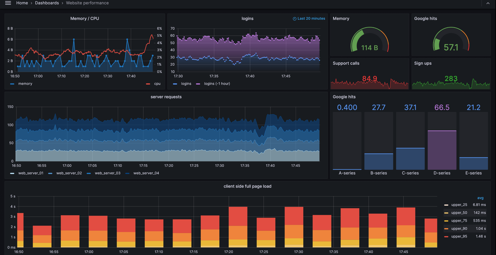

# 监控体系

## 1.监控系统组件

- 指标数据采集
- 指标数据存储
- 指标数据趋势分析及可视化
- 告警

## 2.监控体系

- 系统层监控
  1. 系统监控：CPU、Load、Memory、Swap、Disk IO、Processes、Kernel Parameters、……
  2. 网络监控：网络设备、工作负载、网络延迟、丢包率、……
- 中间件及基础设施类系统监控
  1. 消息中间件：Kafka、RocketMQ和RabbitMQ等。
  2. Web服务容器：Tomcat和Jetty等。
  3. 数据库及缓存系统：MySQL、PostgreSQL、MogoDB、ElasticSearch和Redis等、
  4. 数据库连接池：ShardingSpere等。
  5. 存储系统：NFS和Ceph等。
- 应用层监控
  1. 用于衡量应用程序代码的状态和性能。
- 业务层监控
  1. 用于衡量应用程序的价值，例如电子商务网站上的销售量。
  2. QPS、DAU日活、转化率。
  3. 业务接口：登录数、注册数、订单量、搜索量和支付量等。

## 3. 可观测性

- 可观测性系统
  1. 指标监控（Metrics）：随时间推移产生的一些与监控相关的可聚合数据点。
  2. 日志监控（Logging）：离散式的日志或事件。
  3. 链路跟踪（Tracing）：分布式应用调用链跟踪。
- CNCF将可观测性和数据分析归类一个单独的类别，且划分成了4个子类
  1. 监控系统：以Prometheus等为代表。
  2. 日志系统：以ElasticStack和PLG Stack等为代表。
  3. 布式调用链跟踪系统：以Zipkin、Jaeger、SkyWalking、Pinpoint等为代表。
  4. 混沌工程系统（稳定性测试）：以ChaosMonkey和ChaosBlade等为代表。

## 4. Google SRE的四黄金指标

- 延迟（Latency）
  1. 服务请求所需要的时长，例如HTTP请求平均延迟。
  2. 应用程序响应时间会受到所有核心系统资源（包括网络、存储、CPU和内存）延迟的影响。
  3. 需要区分失败请求和成功请求。
- 流量（Traffic），有时也称为吞吐量
  1. 衡量服务的容量需求， 例如每秒处理的HTTP请求数或者数据库系统的事务数量。
  2. 吞吐量指标包括每秒 Web 请求、API 调用等示例，并且被描述为通常表示为每秒请求数的需求。
- 错误（Errors）
  1. 失败的请求（流量）的数量，通常以绝对数量或错误请求占请求总数的百分比表示。
     - 请求失败的速率，用于衡量错误发生的情况。
  2. HTTP 500错误数等显式失败，返回错误内容或无效内容等隐式失败，以及由策略原因导致的失败（例如强制要求响应时间超过30毫秒的请求视为错误）。
- 饱和度（Saturation）
  1. 衡量资源的使用情况，用于表达应用程序有多满。
     - 资源的整体利用率，包括 CPU（容量、配额、节流）、内存（容量、分配）、存储（容量、分配和 I/O 吞吐量）和网络。
  2. 例如内存、CPU、I/O、磁盘等资源的使用量。

### 4.1. RED方法

> RED方法是Weave Cloud在基于Google的4个黄金指标的原则下结合Prometheus以及Kubernetes容器实践，细化和总结的方法论，特别适合于云原生应用以及微服务架构应用的监控和度量。

- 在四大黄金指标的原则下，RED方法可以有效地帮助用户衡量云原生以及微服务应用下的用户体验问题。
- RED方法主要关注以下3种关键指标
  1. (Request)Rate：每秒钟接收的请求数。
  2. (Request)Errors：每秒失败的请求数。
  3. (Request)Duration：每个请求所花费的时长。

### 4.2. USE方法

> USE方法由Netflix的内核和性能工程师Rendan Gregg提出，主要用于分析系统性能问题。

- 使用率(Utilization)
  1. 关注系统资源的使用情况。 这里的资源主要包括但不限于：CPU，内存，网络，磁盘等等。
  2. 100%的使用率通常是系统性能瓶颈的标志。
- 饱和度(Saturation)
  1. 例如CPU的平均运行排队长度，这里主要是针对资源的饱和度(注意，不同于4大黄金信号)。
  2. 任何资源在某种程度上的饱和都可能导致系统性能的下降。
- 错误(Errors)
  1. 错误计数。
     - 例如：网卡在数据包传输过程中检测到的以太网网络冲突了14次。
