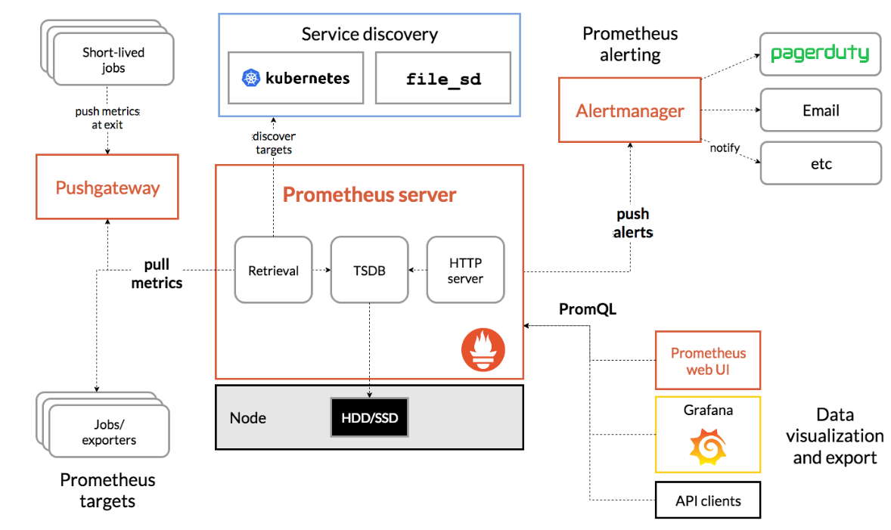
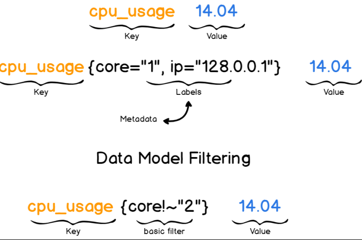

# Prometheus结构介绍

## 1. Prometheus 介绍

:mag:https://prometheus.io

1. Prometheus是基于go语⾔开发的⼀套开源的监控、报警和时间序列数据库的组合，是由SoundCloud公司开发的开源监控系统，Prometheus于2016年加⼊CNCF（Cloud Native Computing Foundation,云原⽣计算基⾦会）,2018年8⽉9⽇prometheus成为CNCF继kubernetes 之后毕业的第⼆个项⽬，prometheus在容器和微服务领域中得到了⼴泛的应用。
2. 使⽤key-value的多维度(多个⻆度，多个层⾯，多个⽅⾯)格式保存数据 ，数据不使⽤MySQL这样的传统数据库，⽽是使⽤时序数据库，⽬前是使⽤的TSDB ⽀持第三⽅dashboard实现更绚丽的图形界⾯，如grafana(Grafana 2.5.0版本及以上) ，组件模块化 ，不需要依赖存储，数据可以本地保存也可以远程保存，平均每个采样点仅占3.5 bytes，且⼀个Prometheus server可以处理数百万级别的的metrics指标数 据。 ⽀持服务⾃动化发现(基于consul等⽅式动态发现被监控的⽬标服务) 强⼤的数据查询语句(PromQL,Prometheus Query Language) ，数据可以直接进⾏算术运算 ，易于横向伸缩 ，众多官⽅和第三⽅的exporter实现不同的指标数据收集。
3. 容器监控的实现⽅对⽐虚拟机或者物理机来说⽐⼤的区别，⽐如容器在k8s环境中可以任意横向扩容与缩容，那么就需要监控服务能够⾃动对新创建的容器进⾏监控，当容器删除后⼜能够及时的从监控服务中删除，⽽传统的zabbix的监控⽅式需要在每⼀个容器中安装启动agent，并且在容器⾃动发现注册及模板关联⽅⾯并没有⽐较好的实现⽅式。
4. Prometheus支持通过三种类型的途径从目标上抓取（Scrape）指标数据。
   - Exporters 
   - Instrumentation 
   - Pushgateway

## 2. Prometheus 生态组件

- Prometheus 生态圈中包含了多个组件，其中部分组件可选：
  1. Prometheus Server: 
     - Prometheus Server是Prometheus组件中的核心部分，负责实现对监控数据的获取，存储以及查询。
     - Prometheus Server可以通过静态配置管理监控目标，也可以配合使用Service Discovery的方式动态管理监控目标，并从这些监控目标中获取数据。其次Prometheus Server需要对采集到的监控数据进行存储，Prometheus Server本身就是一个时序数据库，将采集到的监控数据按照时间序列的方式存储在本地磁盘当中。最后Prometheus Server对外提供了自定义的PromQL语言，实现对数据的查询以及分析。
     - Prometheus Server内置的Express Browser UI，通过这个UI可以直接通过PromQL实现数据的查询以及可视化。
     - Prometheus Server的联邦集群能力可以使其从其他的Prometheus Server实例中获取数据，因此在大规模监控的情况下，可以通过联邦集群以及功能分区的方式对Prometheus Server进行扩展。
  2. Client Library: 
     - 客户端库，目的在于为那些期望原生提供Instrumentation功能的应用程序提供便捷的开发途径。
  3. Push Gateway: 
     - 接收那些通常由短期作业生成的指标数据的网关，并支持由Prometheus Server进行指标拉取操作。
     - 由于Prometheus数据采集基于Pull模型进行设计，因此在网络环境的配置上必须要让Prometheus Server能够直接与Exporter进行通信。 当这种网络需求无法直接满足时，就可以利用PushGateway来进行中转。可以通过PushGateway将内部网络的监控数据主动Push到Gateway当中。而Prometheus Server则可以采用同样Pull的方式从PushGateway中获取到监控数据。
  4. Exporters: 
     - 用于暴露现有应用程序或服务（不支持Instrumentation）的指标给Prometheus Server。
     - Exporter将监控数据采集的端点通过HTTP服务的形式暴露给Prometheus Server，Prometheus Server通过访问该Exporter提供的Endpoint端点，即可获取到需要采集的监控数据。一般来说可以将Exporter分为2类：
       1. 直接采集：这一类Exporter直接内置了对Prometheus监控的支持，比如cAdvisor，Kubernetes，Etcd，Gokit等，都直接内置了用于向Prometheus暴露监控数据的端点。
       2. 间接采集：间接采集，原有监控目标并不直接支持Prometheus，因此我们需要通过Prometheus提供的Client Library编写该监控目标的监控采集程序。例如： Mysql Exporter，JMX Exporter，Consul Exporter等。
  5. Alertmanager: 
     - 从Prometheus Server接收到“告警通知”后，通过去重、分组、路由等预处理功能后以高效向用户完成告警信息发送。
     - 在Prometheus Server中支持基于PromQL创建告警规则，如果满足PromQL定义的规则，则会产生一条告警，而告警的后续处理流程则由AlertManager进行管理。在AlertManager中我们可以与邮件，Slack等等内置的通知方式进行集成，也可以通过Webhook自定义告警处理方式。AlertManager即Prometheus体系中的告警处理中心。
  6. Data Visualization：Prometheus Web UI （Prometheus Server内建），及Grafana等。
  7. Service Discovery：动态发现待监控的Target，从而完成监控配置的重要组件，在容器化环境中尤为有用；该组件目前由Prometheus Server内建支持。

## 3. Prometheus 数据模型

> Prometheus仅用于以“键值”形式存储时序式的聚合数据，它并不支持存储文本信息

1. 其中的==键==称为指标（Metric)，它通常意味着CPU速率、内存使用率或分区空闲比例等。
2. 同一指标可能会适配到多个目标或设备，因而它使用标签作为元数据，从而为Metric添加更多的信息描述纬度。
3. 这些标签还可以作为过滤器进行指标过滤及聚合运算。

### 3.1.定义指标

1. 监控指标格式：<metric name>{<label name>=<label value,……>}
2. 指标名称：用于说明指标的含义，必须由字母、数值下画线或者冒号组成，其中的冒号指标不能用于exporter。
3. 标签：标签可体现指标的维度特征，用于过滤和聚合。它通过标签名（label name）和标签值（label value）这种键值对的形式，形成多种维度。

### 3.2.示例

1. 给定度量标准名称和一组标签，通常使用以下表示法标识时间序列：<metric name>{<label name>=<label value>, ...}
2. 例如，度量标准名称api_http_requests_total和标签 method=“POST” 和 handler="/messages"的时间序列可以这样写：api_http_requests_total{method="POST", handler="/messages"}

### 3.3. 数据样本

1. Prometheus会将所有采集到的样本数据以时间序列（time-series）的方式保存在内存数据库中，并且定时保存到硬盘上。time-series是按照时间戳和值的序列顺序存放的，我们称之为向量(vector). 每条time-series通过指标名称(metrics name)和一组标签集(labelset)命名。
2. 在time-series中的每一个点称为一个样本（sample），样本由以下三部分组成：
   - 指标(metric)：metric name和描述当前样本特征的labelsets。
   - 时间戳(timestamp)：一个精确到毫秒的时间戳。
   - 样本值(value)：一个float64的浮点型数据表示当前样本的值。

## 4.作业（Job）和实例（Instance）

1. Instance：能够接收Prometheus Server数据Scrape操作的每个网络端点（endpoint），即为一个Instance（实例）。
   - 当我们需要采集不同的监控指标(例如：主机、MySQL、Nginx)时，我们只需要运行相应的监控采集程序，并且让Prometheus Server知道这些Exporter实例的访问地址。在Prometheus中，每一个暴露监控样本数据的HTTP服务称为一个实例。例如在当前主机上运行的node exporter可以被称为一个实例(Instance)。
2. 通常，具有类似功能的Instance的集合称为一个Job，例如一个MySQL主从复制集群中的所有MySQL进程。
   - 而一组用于相同采集目的的实例，或者同一个采集进程的多个副本则通过一个一个任务(Job)进行管理。

