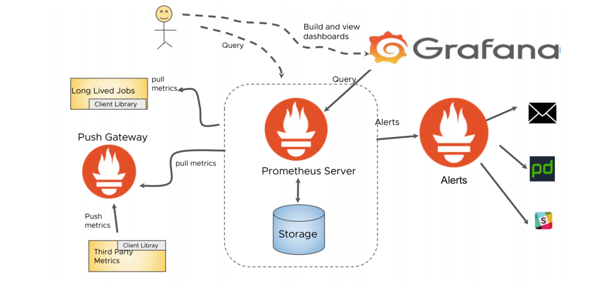
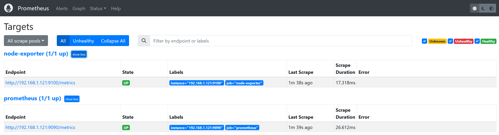
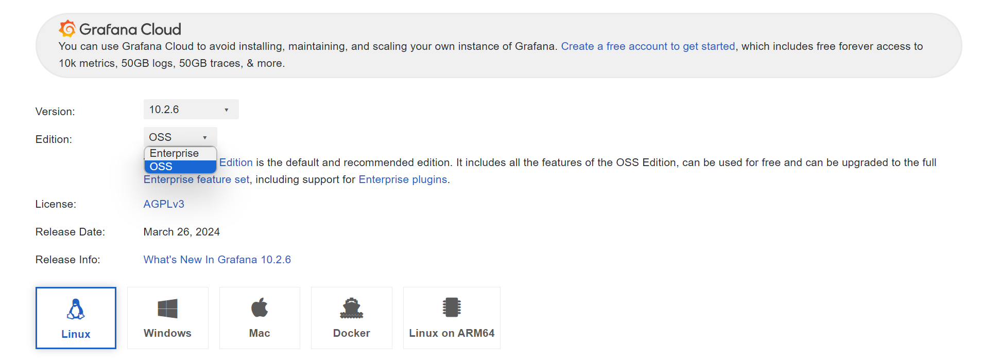
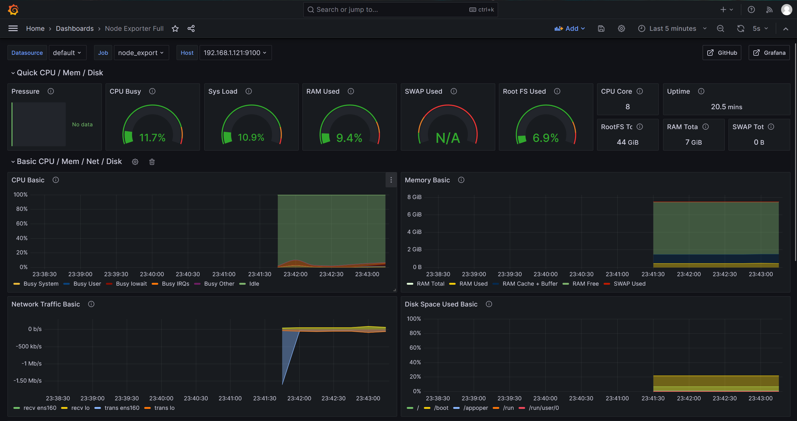

# 二进制部署Prometheus

## 1.下载Prometheus Server

> :mag:https://github.com/prometheus/prometheus/releases
>
> :mag:https://github.com/prometheus/prometheus/releases/download/v2.45.6/prometheus-2.45.6.linux-amd64.tar.gz

## 2.解压二进制程序（root）

~~~shell
##1.创建工作目录
root@A-DSGL-JKPRO01 /root # mkdir /app

##2.解压至目录
root@A-DSGL-JKPRO01 /root # tar xvf  /opt/prometheus-2.45.4.linux-amd64.tar.gz -C /app
root@A-DSGL-JKPRO01 /app # mv prometheus-2.45.4.linux-amd64/ prometheus
~~~

## 3.配置启动文件

~~~shell
root@A-DSGL-JKPRO01 /app/prometheus # vim /usr/lib/systemd/system/prometheus.service
[Unit]
Description=Prometheus Server
After=network.target
Documentation=https://prometheus.io/docs/introduction/overview/

[Service]
Type=simple
WorkingDirectory=/app/prometheus
ExecStart=/app/prometheus/prometheus \
  --web.enable-lifecycle \
  --config.file=/app/prometheus/prometheus.yml \
  --web.read-timeout=5m \
  --web.max-connections=512 \
  --storage.tsdb.retention=15d \
  --storage.tsdb.path=/app/prometheus/data \
  --query.timeout=2m \

Restart=on-failure

[Install]
WantedBy=multi-user.target
~~~

## 4.启动Prometheus

~~~shell
root@A-DSGL-JKPRO01 /app/prometheus # systemctl  daemon-reload 
root@A-DSGL-JKPRO01 /app/prometheus # systemctl  enable   --now  prometheus.service
root@A-DSGL-JKPRO01 /app/prometheus # systemctl   status  prometheus.service 
~~~

## 5.部署node_export

> :mag:https://github.com/prometheus/node_exporter/releases
>
> :mag:https://github.com/prometheus/node_exporter/releases/download/v1.8.0/node_exporter-1.8.0.linux-amd64.tar.gz

## 6.解压程序

~~~shell
##1.解压至目录
root@A-DSGL-JKPRO01 /opt # tar  -xvf /opt/node_exporter-1.8.2.linux-amd64.tar.gz  -C /app
root@A-DSGL-JKPRO01 /app # mv node_exporter-1.8.2.linux-amd64/ node_exporter
~~~

## 7.配置启动文件

~~~shell
root@A-DSGL-JKPRO01 /app #  vim /usr/lib/systemd/system/node_export.service
[Unit]
Description=Node Export
After=network.target
Documentation=https://prometheus.io/docs/guides/node-exporter/

[Service]
Type=simple
WorkingDirectory=/app/node_exporter
ExecStart=/app/node_exporter/node_exporter
Restart=on-failure

[Install]
WantedBy=multi-user.target
~~~

## 8.启动node_exporter

~~~shell
root@A-DSGL-JKPRO01 /app # systemctl daemon-reload                         
root@A-DSGL-JKPRO01 /app # systemctl enable  --now  node_export.service    
root@A-DSGL-JKPRO01 /app # systemctl status  node_export.service  
~~~

### 8.1.添加Prometheus监控

~~~shell
root@A-DSGL-JKPRO01 /app/prometheus # vim prometheus.yml 
global:
  scrape_interval: 15s # Set the scrape interval to every 15 seconds. Default is every 1 minute.
  evaluation_interval: 15s # Evaluate rules every 15 seconds. The default is every 1 minute.
  # scrape_timeout is set to the global default (10s).
alerting:
  alertmanagers:
    - static_configs:
        - targets:
          # - alertmanager:9093
rule_files:
  # - "first_rules.yml"
  # - "second_rules.yml"
scrape_configs:
  # The job name is added as a label `job=<job_name>` to any timeseries scraped from this config.
  - job_name: "prometheus"
    # metrics_path defaults to '/metrics'
    # scheme defaults to 'http'.
    static_configs:
      - targets: ["192.168.1.121:9090"]
  - job_name: "node-exporter"             ##————————————————————
    # metrics_path defaults to '/metrics'
    # scheme defaults to 'http'.
    static_configs:
      - targets: ["192.168.1.121:9100"]   ##————————————————————
~~~

### 8.2.动态加载配置Prometheus

~~~shell
root@A-DSGL-JKPRO01 /app/prometheus # vim /usr/lib/systemd/system/prometheus.service 
--web.enable-lifecycle

root@A-DSGL-JKPRO01 /app/prometheus # curl -X POST http://192.168.1.121:9090/-/reload
~~~

### 8.3.验证

## 9.安装Grafana

> :mag:https://grafana.com/grafana/download?pg=graf-deployment-options&plcmt=deploy-box-1

## 10.解压程序

~~~shell
##1.解压至目录
root@A-DSGL-JKPRO01 /opt # tar -xvf /opt/grafana-10.2.6.linux-amd64.tar.gz -C /app
root@A-DSGL-JKPRO01 /app # mv grafana-v10.2.6/ grafana
~~~

## 11.配置启动文件

~~~shell
root@A-DSGL-JKPRO01 /app/grafana/conf # vim /usr/lib/systemd/system/grafana-server.service
[Unit]
Description=Grafana instance
Documentation=http://docs.grafana.org
Wants=network-online.target
After=network-online.target
#After=postgresql.service mariadb.service mysqld.service influxdb.service

[Service]
Type=notify
Restart=on-failure
WorkingDirectory=/app/grafana/
RuntimeDirectory=/app/grafana/
ExecStart=/app/grafana/bin/grafana-server      \
  --homepath=/app/grafana                      \
  --config=/app/grafana/conf/defaults.ini      \

[Install]
WantedBy=multi-user.target
~~~

## 12.启动Grafana

~~~shell
root@A-DSGL-JKPRO01 /app/grafana/conf # systemctl daemon-reload 
root@A-DSGL-JKPRO01 /app/grafana/conf # systemctl enable  --now grafana-server.service 
Created symlink /etc/systemd/system/multi-user.target.wants/grafana-server.service → /usr/lib/systemd/system/grafana-server.service.
root@A-DSGL-JKPRO01 /app/grafana/conf # systemctl status  grafana-server.service  
~~~

## 13.登录导入验证（ID：1860）

