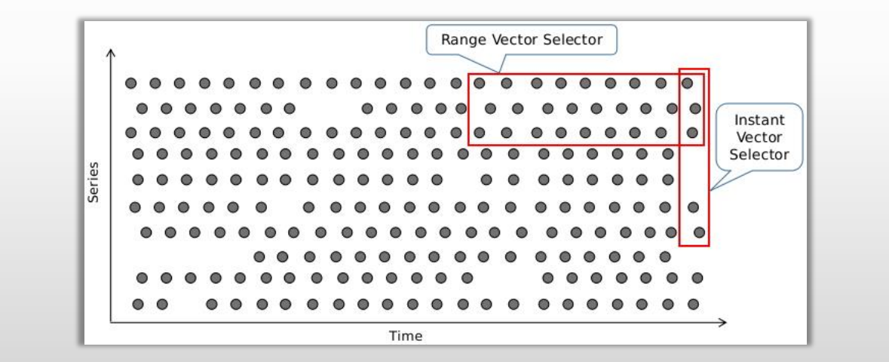
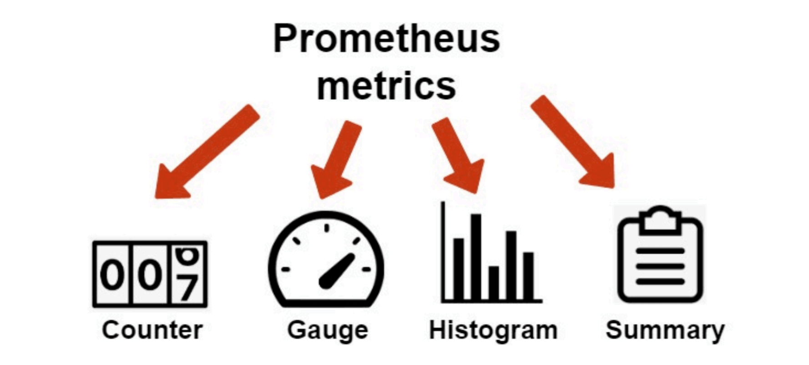
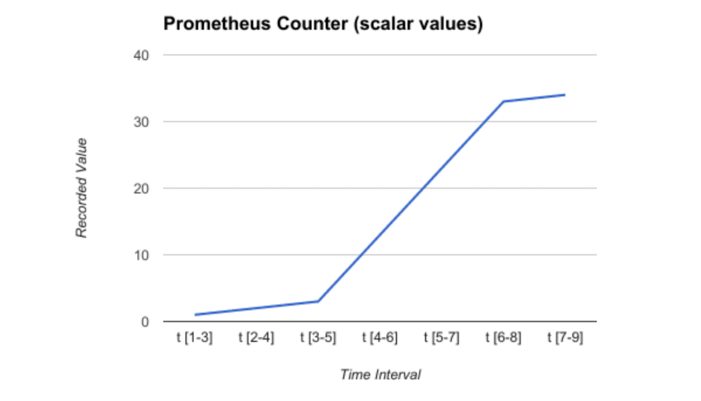
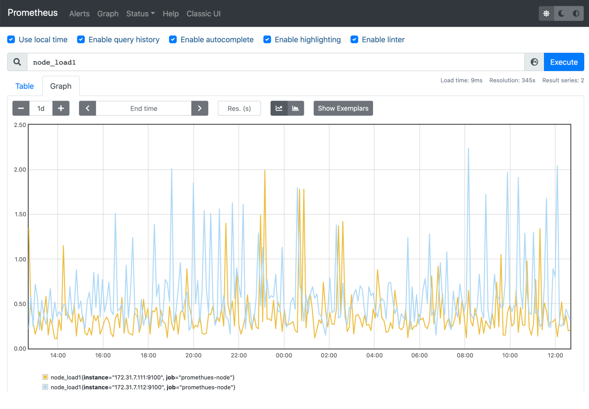
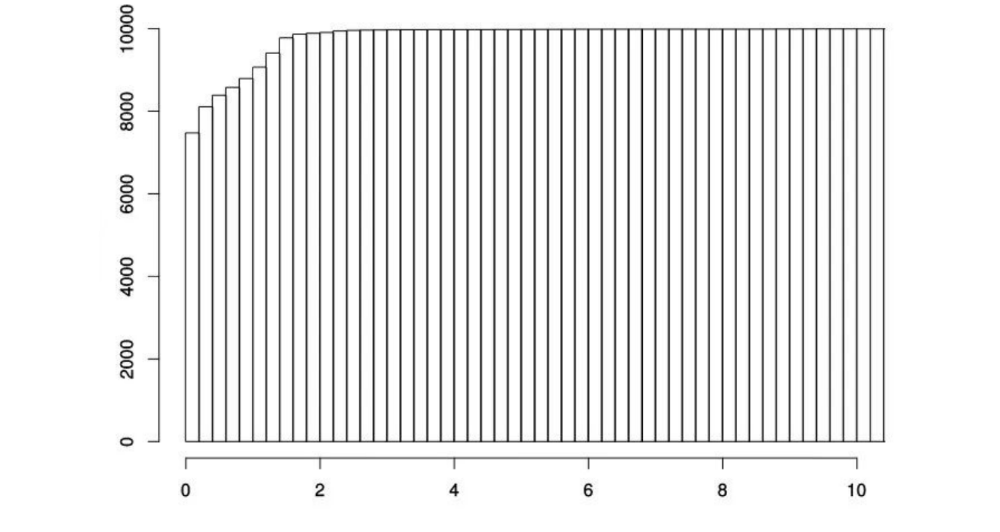
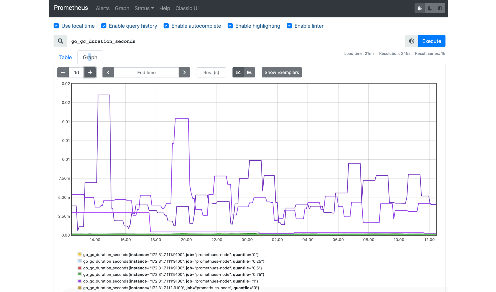

# PromQL表达式语言

## 1.PromQL的数据类型

- PromQL的表达式中支持4种数据类型

  1. 即时向量 (瞬时向量)（Instant Vector）：特定或全部的时间序列集合上，具有相同时间戳的一组样本值称为即时向量

     - 比如node_memory_MemFree_bytes查询当前剩余内存就是⼀个瞬时向量，该表达式的返回值中只会包含该时

       间序列中的最新的⼀个样本值。例如：prometheus_http_requests_total

  2. 范围向量（Range Vector）：特定或全部的时间序列集合上，在指定的同一时间范围内的所有样本值

     - 例如：prometheus_http_requests_total[5m]

  3. 标量（Scalar）：一个浮点型的数据值

     - 使⽤node_load1获取到时⼀个瞬时向量，但是可⽤使⽤内置函数scalar()将瞬时向量转换为标量，例如：scalar(sum(node_load1))

  4. 字符串（String）：支持使用单引号、双引号或反引号进行引用，但反引号中不会对转义字符进行转义

     - ⽬前未使⽤

## 2.时间序列选择器（Time series Selectors）

- PromQL的查询操需要针对有限个时间序列上的样本数据进行，挑选出目标时间序列是构建表达式时

  最为关键的一步。

- 使用向量选择器表达式来挑选出给定指标名称下的所有时间序列或部分时间序列的即时（当前）样本

  值或至过去某个时间范围内的样本值，前者称为即时向量选择器，后者称为范围向量选择器。

  1. 即时向量选择器（Instant Vector Selectors）：返回0个、1个或多个时间序列上在给定时间戳（instant）上的各自的一

     个样本，该样本也可称为即时样本；

  2. 范围向量选择器（Range Vector Selectors） ：返回0个、1个或多个时间序列上在给定时间范围内的各自的一组样本；

### 2.1.向量表达式使用要点

- 表达式的返回值类型亦是即时向量、范围向量、标题或字符串4种数据类型其中之一，但是，有些使用场景要求表达式返回值必须满足特定的条件，例如:
  1. 需要将返回值绘制成图形时，仅支持即时向量类型的数据；
  2. 对于诸如rate一类的速率函数来说，其要求使用的却又必须是范围向量型的数据；
- 由于范围向量选择器的返回的是范围向量型数据，它不能用于表达式浏览器中图形绘制功能，否则，表达式浏览器会返回“Error executing query: invalid expression type "range vector" for range query, must be Scalar or instant Vector”一类的错误
  1. 事实上，范围向量选择几乎总是结合速率类的函数rate一同使用;

### 2.2.即时向量选择器 Instant vector selectors

- 即时向量选择器由两部分组成；
  1. 指标名称：用于限定特定指标下的时间序列，即负责过滤指标；可选；
  2. 匹配器（Matcher）：或称为标签选择器，用于过滤时间序列上的标签；定义在{}之中；可选；
- 显然，定义即时向量选择器时，以上两个部分应该至少给出一个；于是，这将存在以下三种组合；
  1. 仅给定指标名称，或在标签名称上使用了空值的匹配器：返回给定的指标下的所有时间序列各自的即时样本；
     - 例如，http_requests_total和http_requests_total{}的功能相同，都是用于返回http_requests_total指标下各时间序列的即时样本；
  2. 仅给定匹配器：返回所有符合给定的匹配器的所有时间序列上的即时样本；
     - 注意：这些时间序列可能会有着不同的指标名称；
     - 例如， {job=".*", method="get"}
  3. 指标名称和匹配器的组合：返回给定的指定下的，且符合给定的标签过滤器的所有时间序列上的即时样本；
     -  例如， http_requests_total{method="get"}

#### 2.2.1.匹配器 Matcher

- 匹配器用于定义标签过滤条件，目前支持如下4种匹配操作符；
  1. `=` ：选择与提供的字符串完全相同的标签。
  2. `!=` ：选择不等于提供的字符串的标签。
  3. `=~` ：选择与提供的字符串正则表达式匹配的标签。
  4. `!~` ：选择与提供的字符串正则表达式不匹配的标签。
- 注意事项
  1. 匹配到空标签值的匹配器时，所有未定义该标签的时间序列同样符合条件；
     - 例如，http_requests_total{env= ""}，则该指标名称上所有未使用该标签（env）的时间序列也符合条件，比如时间序列http_requests_total{method ="get"} ；
  2. 正则表达式将执行完全锚定机制，它需要匹配指定的标签的整个值；
     - `env=~"foo"`的匹配被视为`env=~"^foo$"` 。
  3. 向量选择器至少要包含一个指标名称，或者至少有一个不会匹配到空字符串的匹配器；
     - 例如，{job=""}为非法的选择器；
  4. 使用“\__name__”做为标签名称，还能够对指标名称进行过滤；
     - 例如，{\__name__=~"http_requests_.*"}能够匹配所有以“ http_requests_ ”为前缀的所有指标；

### 2.3.范围向量选择器 Range Vector Selectors

- 同即时向量选择器的唯一不同之处在于，范围向量选择器需要在表达式后紧跟一个方括号[ ]来表达需在时间时序上返回的样本所处的时间范围；
  1. 时间范围：以当前时间为基准时间点，指向过去一个特定的时间长度；例如[5m]便是指过去5分钟之内；
- 时间格式：一个整数后紧跟一个时间单位，例如“5m”中的“m”即是时间单位；
  1. 可用的时间单位有ms（毫秒）、s（秒）、m（分钟）、h（小时）、d（天）、w（周）和y（年）;
  2. 必须使用整数时间，且能够将多个不同级别的单位进行串联组合，以时间单位由大到小为顺序，例如1h30m，但不能使用1.5h；
- 需要注意的是，范围向量选择器返回的是一定时间范围内的数据样本，虽然不同时间序列的数据抓取时间点相同，但它们的时间戳并不会严格对齐；
  1. 多个Target上的数据抓取需要分散在抓取时间点前后一定的时间范围内，以均衡Prometheus Server的负载；
  2. 因而，Prometheus在趋势上准确，但并非绝对精准；

#### 2.3.1. 偏移量修改器 Offset modifier

- 默认情况下，即时向量选择器和范围向量选择器都以当前时间为基准时间点，而偏移量修改器能够修改该基准；
- 偏移量修改器的使用方法是紧跟在选择器表达式之后使用“offset”关键字指定
  1. `http_requests_total offset 5m`，表示获取以http_requests_total为指标名称的所有时间序列在过去5分钟之时的即时样本；
  2. `http_requests_total[5m] offset 1d`，表示获取距此刻1天时间之前的5分钟之内的所有样本；

## 3.指标类型

- Prometheus使用4种方法来描述监视的指标

### 3.1.Counter

- 计数器，counter是一个累积指标，代用于保存单调递增型的数据，其值只能增加或在重新启动时重置为零。 例如，例如站点访问次数等；不能为负值，也不支持减少，但可以重置回0。
- 不要使用计数器来显示会减小的值。例如，请勿对当前正在运行的进程数使用计数器； 而是使用 gauge。

#### 3.1.1.Counter 型指标及常用函数

- 通常，Counter的总数并没有直接作用，而是需要借助于rate、increase和irate等函数来生成样本数据的变化状况（增长率）；
  1. rate(nginx_http_requests_total[1m])，获取1分钟内，该指标各相关时间序列上的http总请求数的平均增长速率；
     - 指定时间范围内的样本的最后一个样本值减去第一个样本值，而后除以这两个样本之间的间隔时长；
  2. irate(nginx_http_requests_total[1m])，高灵敏度函数，用于计算指标的瞬时速率；
     - 基于样本范围内的最后两个样本计算增长的速率，即最后一个样本减去其前面的一个样本，并除以间隔的时长；
     - 相较于rate函数来说，irate更适用于短期时间范围内的变化速率分析；
  3. icrease(nginx_http_requests_total[1m])：计算指定时间范围内样本值的增加量
     - 可能会引用时间范围边界之前的样本值，以便于整个计算能覆盖指定的整个时间范围

### 3.2.Gauge

- 仪表盘，用于存储有着起伏特征的指标数据，例如并发请求数。比如磁盘容量、内存使用量就必须使用 gauge来度量。
- Gauge是Counter的超集；但存在指标数据丢失的可能性时，Counter能让用户确切了解指标随时间的变化状态，而Gauge则可能随时间流逝而精准度越来越低。

#### 3.2.1.Gauge型指标及常用函数

- Gauge用于存储其值可增可减的指标的样本数据，常用于进行求和、取平均值、最小值、最大值等聚合计算；也会经常结合PromQL的predict_linear和delta函数使用；
  1. predict_linear(v range-vector, t, scalar)：预测时间序列v在t秒后的值，它通过线性回归的方式来预测样本数据的Gauge变化趋势；
  2. delta(v range-vector)：计算范围向量中每个时间序列上的第一个样本值与最后一个样本值之差；
     - 其计算结果与increase函数相同；
     - 返回具有给定增量和等效标签的即时向量；
     - delta(cpu_temp_celsius{host="server01.magedu.com"}[2h])，返回该服务器上的CPU温度与2小时之前的差异；
  3. idelta(v range-vector)：计算范围向量中每个时间序列上最后两个样本之差，返回具有给定增量和等效标签的即时向量；
  4.  topk(3, jvm_memory_bytes_used{area="heap"})，jvm堆内存用量排名前三的时间序列；

### 3.3.Histogram

- 直方图，它会在一段时间范围内对数据进行采样，并将其计入可配置的bucket之中；Histogram能够存储更多的信息，包括样本值分布在每个bucket（bucket自身的可配置）中的数量、所有样本值之和以及总的样本数量，从而Prometheus能够使用内置的函数进行如下操作：
  1. 计算样本平均值：以值的总和除以值的数量。
  2. 计算样本分位值：分位数有助于了解符合特定标准的数据个数；例如评估响应时长超过1秒钟的请求比例，若超过20%即发送告警等。
- Histogram是一种对数据分布情况的图形表示，由一系列高度不等的长条图（bar）或线段表示，用于展示单个测度的值的分布
  1. 它一般用横轴表示某个指标维度的数据取值区间，用纵轴表示样本统计的频率或频数，从而能够以二维图的形式展现数值的分布状况.
  2. 为了构建Histogram，首先需要将值的范围进行分段，即将所有值的整个可用范围分成一系列连续、相邻（相邻处可以是等同值）但不重叠的间隔，而后统计每个间隔中有多少值
  3. 从统计学的角度看，分位数不能被聚合，也不能进行算术运算；

#### 3.3.1.Histogram型指标及常用函数

- 对于Prometheus来说，Histogram会在一段时间范围内对数据进行采样（通常是请求持续时长或响应大小等），并将其计入可配置的bucket（存储桶）中
  1. Histogram事先将特定测度可能的取值范围分隔为多个样本空间，并通过对落入bucket内的观测值进行计数以及求和操作
  2. 与常规方式略有不同的是，Prometheus取值间隔的划分采用的是累积（Cumulative）区间间隔机制，即每个bucket中的样本均包含了其前面所有bucket中的样本，因而也称为累积直方图
     - 可降低Histogram的维护成本
     - 支持粗略计算样本值的分位数
     - 单独提供了_sum和_count指标，从而支持计算平均值
- Histogram类型的每个指标有一个基础指标名称<basename>，它会提供多个时间序列：
  1. <basename>_bucket{le="<upper inclusive bound>"}：观测桶的上边界（upper inclusive bound），即样本统计区间，最大区间（包含所有样本）的名称为<basename>_bucket{le="+Inf"}；
  2. <basename>_sum：所有样本观测值的总和；
  3. <basename>_count ：总的观测次数，它自身本质上是一个Counter类型的指标；
- 累积间隔机制生成的样本数据需要额外使用内置的histogram_quantile()函数即可根据Histogram指标来计算相应的分位数（quantile），即某个bucket的样本数在所有样本数中占据的比例
  1. histogram_quantile(φ scalar, b instant-vector)：基于histogram类型的样本数据计算 φ 分位数 (0 ≤ φ ≤ 1)
     -  φ 为期望计算的分位数，例如0.9，或者0.99等；
     - b 是histogram类型的时间序列，其指标名称通常为原指标名称后跟一个“_bucket”后缀
  2. histogram_quantile()函数在计算分位数时会假定每个区间内的样本满足线性分布状态，因而它的结果仅是一个预估值，并不完全准确；
  3. 预估的准确度取决于bucket区间划分的粒度；粒度越大，准确度越低；

### 3.4.Summary

- 摘要，Histogram的扩展类型，但它是直接由被监测端自行聚合计算出分位数，并将计算结果响应给Prometheus Server的样本采集请求；因而，其分位数计算是由由监控端完成。

- 指标类型是客户端库的特性，而Histogram在客户端仅是简单的桶划分和分桶计数，分位数计算由Prometheus Server基于样本数据进行估算，因而其结果未必准确，甚至不合理的bucket划分会导致较大

  的误差；

- Summary是一种类似于Histogram的指标类型，但它在客户端于一段时间内（默认为10分钟）的每个采样点进行统计，计算并存储了分位数数值，Server端直接抓取相应值即可；

- 但Summary不支持sum或avg一类的聚合运算，而且其分位数由客户端计算并生成，Server端无法获取客户端未定义的分位数，而Histogram可通过PromQL任意定义，有着较好的灵活性；

#### 3.4.1.Summary型指标及常用函数

- 对于每个指标，Summary以指标名称<basename>为前缀，生成如下几个个指标序列
  1. <basename>{quantile="<φ>"}，其中φ是分位点，其取值范围是(0 ≤φ≤ 1)；计数器类型指标；如下是几种典型的常用分位点
     - 0、0.25、0.5、0.75和1几个分位点；
     - 0.5、0.9和0.99几个分位点；
     - 0.01、0.05、0.5、0.9和0.99几个分位点；
  2. <basename>_sum，抓取到的所有样本值之和；
  3. <basename>_count，抓取到的所有样本总数；

