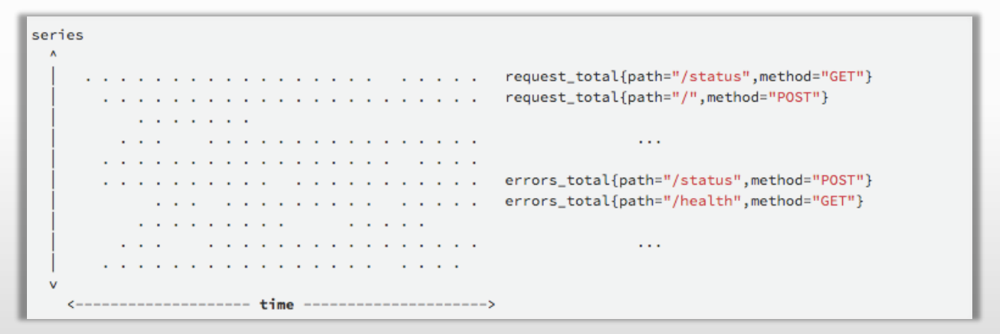
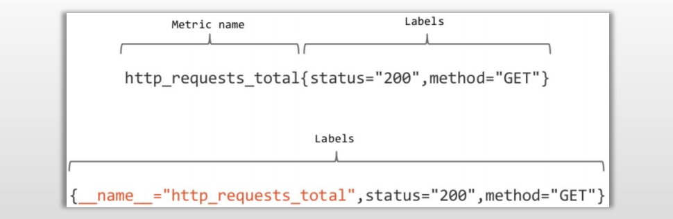
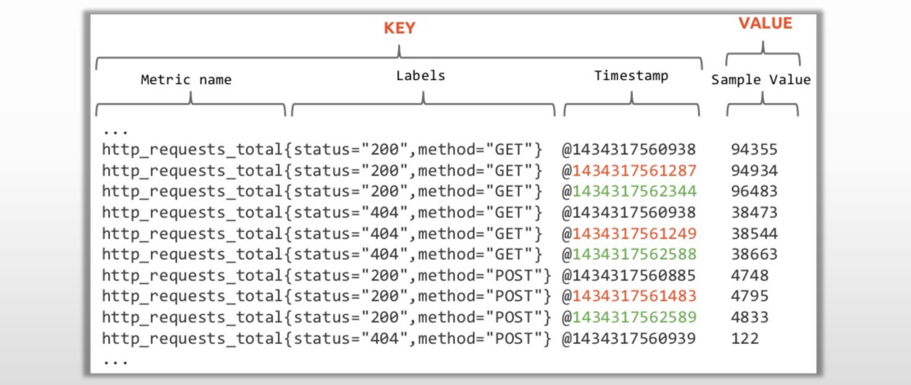

# PromQL简介

## 1..Prometheus时间序列

- 时间序列数据：按照时间顺序记录系统、设备状态变化的数据，每个数据称为一个样本。

  1. 数据采集以特定的时间周期进行，因而，随着时间流逝，将这些样本数据记录下来，将生成一个离散的样

     本数据序列；

  2. 该序列也称为向量（Vector）；而将多个序列放在同一个坐标系内（以时间为横轴，以序列为纵轴），将形

     成一个由数据点组成的矩阵；

## 2.PromQL概念

- Prometheus基于指标名称（metrics name）以及附属的标签集（labelset）唯一定义一条时间序列

  1. 指标名称代表着监控目标上某类可测量属性的基本特征标识
  2. 标签则是这个基本特征上再次细分的多个可测量维度

- 基于PromQL表达式，用户可以针对指定的特征及其细分的纬度进行过滤、聚合、统计等运算从而产

  生期望的计算结果

- PromQL (Prometheus Query Language)是Prometheus Server内置数据查询语言

  1. PromQL使用表达式（expression）来表述查询需求

  2. 根据其使用的指标和标签，以及时间范围，表达式的查询请求可灵活地覆盖在一个或多个时间序列的一定范

     围内的样本之上，甚至是只包含单个时间序列的单个样本

## 3.Prometheus数据模型

- Prometheus中，每个时间序列都由指标名称（Metric Name）和标签（Label）来唯一标识，格式为

  `<metric name>{<label name>=<label value>, …}`

  1. ​	指标名称：通常用于描述系统上要测定的某个特征
     - 例如，http_requests_total表示接收到的HTTP请求总数;
     - 支持使用字母、数字、下划线和冒号，且必须能匹配RE2规范的正则表达式；
  2. 标签：键值型数据，附加在指标名称之上，从而让指标能够支持多纬度特征；可选项
     - 例如，`http_requests_total{method=GET}和http_requests_total{method=POST}`代表着两个不同的时间序列；
     - 标签名称可使用字母、数字和下划线，且必须能匹配RE2规范的正则表达式；
     - 以“_ _”为前缀的名称为Prometheus系统预留使用；

- Metric Name的表示方式有两种

  1. prometheus_http_requests_total{code="200",handler="/api/v1/query"}
  2. {\__name__="prometheus_http_requests_total",code="200",handler="/api/v1/query"}

## 4.样本数据格式

- Prometheus的每个数据样本由两部分组成
  1. float64格式的数据
  2. 毫秒精度的时间戳

## 5.指标名称及标签使用注意事项

- 指标名称和标签的特定组合代表着一个时间序列；

  1. 指标名称相同，但标签不同的组合分别代表着不同的时间序列；
  2. 不同的指标名称自然更是代表着不同的时间序列；

- PromQL支持基于定义的指标维度进行过滤和聚合

  1. 更改任何标签值，包括添加或删除标签，都会创建一个新的时间序列;

  2. 应该尽可能地保持标签的稳定性，否则，则很可能创建新的时间序列，更甚者会生成一个动态的数据环境，

     并使得监控的数据源难以跟踪，从而导致建立在该指标之上的图形、告警及记录规则变得无效;