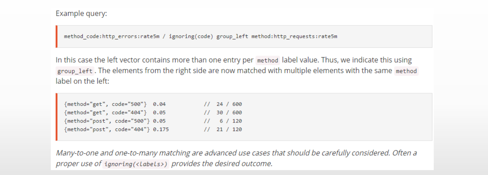

# PromQL的聚合函数

## 1.Prometheus的聚合函数

- 一般说来，单个指标的价值不大，监控场景中往往需要联合并可视化一组指标，这种联合机制即是指`聚合`操作，例如，将计数、求和、平均值、分位数、标准差及方差等统计函数应用于时间序列的样本之上生成具有统计学意义的结果等
- 对查询结果事先按照某种分类机制进行分组（groupby）并将查询结果按组进行聚合计算也是较为常见的需求，例如分组统计、分组求平均值、分组求和等
- 聚合操作由`聚合函数`针对一组值进行计算并返回单个值或少量几值作为结果
  1. Prometheus内置提供的11个聚合函数也称为聚合运算符
  2. 这些运算符仅支持应用于单个即时向量的元素，其返回值也是具有少量元素的新向量或标量
  3. 这些聚合运行符既可以基于向量表达式返回结果中的时间序列的所有标签维度进行分组聚合，也可以仅基于指定的标签维度分组后再进行分组聚合

## 2.聚合表达式

- PromQL中的聚合操作语法格式可采用如下面两种格式之一
  1. \<aggr-op>([parameter,] \<vector expression>) [without|by (\<label list>)]
  2. \<aggr-op> [without|by (\<label list>)] ([parameter,] \<vector expression>)
- 分组聚合：先分组、后聚合
  1. without：从结果向量中删除由without子句指定的标签，未指定的那部分标签则用作分组标准；
  2. by：功能与without刚好相反，它仅使用by子句中指定的标签进行聚合，结果向量中出现但未被by子句指定的标签则会被忽略；
     - 为了保留上下文信息，使用by子句时需要显式指定其结果中原本出现的job、instance等一类的标签
- 各函数工作机制的不同之处也仅在于计算操作本身，PromQL对于它们的执行逻辑相似；

## 3.11个聚合函数

1. sum( )：对样本值求和；
2. avg ( ) ：对样本值求平均值，这是进行指标数据分析的标准方法；
3. count ( ) ：对分组内的时间序列进行数量统计；
4. stddev ( ) ：对样本值求标准差，以帮助用户了解数据的波动大小（或称之为波动程度）；
5. stdvar ( ) ：对样本值求方差，它是求取标准差过程中的中间状态；
6. min ( ) ：求取样本值中的最小者；
7. max ( ) ：求取样本值中的最大者；
8. topk ( ) ：逆序返回分组内的样本值最大的前k个时间序列及其值；
9. bottomk ( ) ：顺序返回分组内的样本值最小的前k个时间序列及其值；
10. quantile ( ) ：分位数用于评估数据的分布状态，该函数会返回分组内指定的分位数的值，即数值落在小于等于指定的分位区间的比例；
11. count_values ( ) ：对分组内的时间序列的样本值进行数量统计；

## 4.二元运算符

- PromQL支持基本的算术运算和逻辑运算，这类运算支持使用操作符连接两个操作数，因而也称为二元运算符或二元操作符；
  1. 支持的运算
     - 两个标量间运算；
     - 即时向量和标量间的运算：将运算符应用于向量上的每个样本；
     - 两个即时向量间的运算：遵循向量匹配机制；
  2. 将运算符用于两个即时向量间的运算时，可基于向量匹配模式（Vector Matching）定义其运算机制；
- 算术运算
  1. 支持的运算符：+（加）、-（减）、*（乘）、/（除）、%（取模）和^（幂运算）
- 比较运算
  1. 支持的运算符：==（等值比较）、!=（不等）、>、<、>=和<=（小于等于）
- 逻辑/集合运算
  1. 支持的运算符：and（并且）、or（或者）和unless（除了）；
  2. 目前，该运算仅允许在两个即时向量间进行，尚不支持标量参与运算；

### 4.1.二元运算符优先级

- Prometheus的复杂运算中，二元运算符存在如下给定次序中所示的由高到低的优先级
  1. ^
  2. *, /, %
  3. +, -
  4. ==, !=, <=, <, >=, >
  5. and, unless
  6. or
- 具有相同优先级的运算符满足结合律（左结合），但幂运算除外，因为它是右结合机制；
- 可以使用括号( )改变运算次序；

## 5.向量匹配

- 即时向量间的运算是PromQL的特色之一；运算时，PromQL为会左侧向量中的每个元素找到匹配的元素，其匹配行为有两种基本类型
  1. 一对一 （One-to-One）
  2. 一对多或多对一 （Many-to-One, One-to-Many）

### 5.1.向量一对一匹配

- 即时向量的一对一匹配
  1. 从运算符的两边表达式所获取的即时向量间依次比较，并找到唯一匹配（标签完全一致）的样本值；
  2. 找不到匹配项的值则不会出现在结果中；
- 匹配表达式语法
  1. \<vector expr> \<bin-op> ignoring(\<label list>) \<vector expr>
  2. \<vector expr> \<bin-op> on(\<label list>) \<vector expr>
     - ignore：定义匹配检测时要忽略的标签；
     - on：定义匹配检测时只使用的标签；
  3. 例如，`rate(http_requests_total{status_code=~"5.*"}[5m]) > .1 * rate(http_requests_total[5m])`
     - 左侧会生成一个即时向量，它计算出5xx响应码的各类请求的增长速率；
       1. 除了status_code标签外，该指标通常还有其它标签；于是，status_code的值为500的标签同其它标签的每个组合将代表序列，其相应的即时样本即为结果向量的一个元素；
     - 右侧会生成一个即时向量，它计算出所有标签组合所代表的各类请求的增长速率；
     - 计算时，PromQL会在操作符左右两侧的结果元素中找到标签完全一致的元素进行比较；
     - 其意义为，计算出每类请求中的500响应码在该类请求中所占的比例；

#### 5.2.一对一匹配示例

### 5.3.向量一对多/多对一匹配

- 一对多/多对一匹配
  1. “一”侧的每个元素，可与“多”侧的多个元素进行匹配；
  2. 必须使用group_left或group_right明确指定哪侧为“多”侧；
- 匹配表达式语法
  1. \<vector expr> \<bin-op> ignoring(\<label list>) group_left(\<label list>) \<vector expr>
  2. \<vector expr> \<bin-op> ignoring(\<label list>) group_right(\<label list>) \<vector expr>
  3. \<vector expr> \<bin-op> on(\<label list>) group_left(\<label list>) \<vector expr>
  4. \<vector expr> \<bin-op> on(\<label list>) group_right(\<label list>) \<vector expr>

#### 5.3.1.多对一匹配示例

