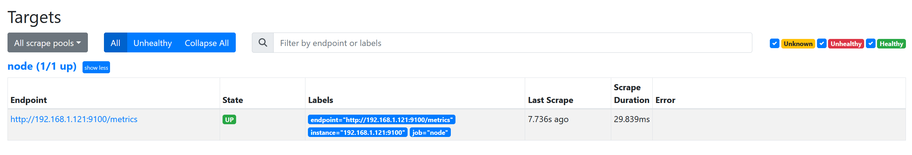

# Prometheus重新定义标签

## 1.对target重新打标

- 对target重新打标是在数据抓取之前动态重写target标签的强大工具，在每个数据抓取配置中，可以定义多个relabel步骤，它们将按照定义的顺序依次执行；
  1. 对于发现的每个target，Prometheus默认会执行如下操作
     - job的标签设定为其所属的job_name的值；
     - \__address__标签的值为该target的套接字地址\<host>:\<port>
     - instance标签的值为\__address__的值；
     - \__scheme__标签的值为抓取该target上指标时使用的协议（http或https）；
     - \__metrics_path__标签的值为抓取该target上的指标时使用URI路径，默认为/metrics；
     - \__param__\<name>标签的值为传递的URL参数中第一个名称为\<name>的参数的值；
  2. 重新标记期间，还可以使用该target上以“\__meta__”开头的元标签；
     - 各服务发现机制为其target添加的元标签会有所不同；
  3. 重新标记完成后，该target上以“__”开头的所有标签都会被移除；
     - 若在relabel的过程中需要临时存储标签值，则要使用__tmp标签名称为前缀进行保存，以避免同Prometheus的内建标签冲突；

## 2.relabel_config

~~~yaml
# The source labels select values from existing labels. Their content is concatenated
# using the configured separator and matched against the configured regular expression
# for the replace, keep, and drop actions.
[ source_labels: '[' <labelname> [, ...] ']' ]

# Separator placed between concatenated source label values.
[ separator: <string> | default = ; ]

# Label to which the resulting value is written in a replace action.
# It is mandatory for replace actions. Regex capture groups are available.
[ target_label: <labelname> ]

# Regular expression against which the extracted value is matched.
[ regex: <regex> | default = (.*) ]

# Modulus to take of the hash of the source label values.
[ modulus: <int> ]

# Replacement value against which a regex replace is performed if the
# regular expression matches. Regex capture groups are available.
[ replacement: <string> | default = $1 ]

# Action to perform based on regex matching.
[ action: <relabel_action> | default = replace ]
~~~

### 2.1.relabel_config解析

#### 2.1.1.source_labels

- `source_labels`
  1. 格式：`source_labels: ['<labelname1>', '<labelname2>', ...]`
  2. 作用：指定一个或多个源标签，其值将被提取、连接、并用于后续的正则表达式匹配、替换、哈希计算等操作。
  3. 类型：列表
  4. 内容：标签名（`<labelname>`）的字符串列表。
- `<labelname>`
  1. 定义：一个占位符，表示Prometheus中任何有效的标签名。
  2. 示例: `job`, `instance`, `__address__` 等。通常，标签名可以是Prometheus中所有时间序列所关联的标签（例如`job`和`instance`），也可以是自动生成的内部标签（例如`__address__`，用于表示目标的网络地址）。

#### 2.1.2.separator

- `separator`
  1. 格式：`separator: ';'`,默认是 `;`
  2. 类型：字符串
  3. 作用：当`source_labels`包含多个标签时，Prometheus会按照`separator`指定的字符将这些标签的值连接成一个字符串。该字符串可以用作正则表达式的匹配对象

#### 2.1.3.target_label

- `target_label`
  1. 格式：`target_label: <labelname>`
  2. 类型：字符串
  3. 作用：通过 action 处理之后的新的标签名字，将结果值最终会被赋给哪个标签。

#### 2.1.4.regex

- `regex`
  1. 格式：`regex:  (job|app)  |  default = (.*)`
  2. 类型：正则表达式字符串
  3. 作用：用于匹配连接后的标签值或特定标签值（给定的值或正则表达式匹配，匹配源标签）如果匹配成功，则执行指定的动作（如 `replace`、`keep`、`drop` 等）。

#### 2.1.5.modulus

- `modulus`
  1. 格式：`modulus: <int>`
  2. 类型：整数（`int`）
  3. 作用：指定用于取模运算的模数，表示将标签值的哈希值除以该模数，取余数。

#### 2.1.6.replacement

- `replacement`
  1. 格式：`replacement: <string> | default = $1`
  2. 类型：字符串
  3. 作用：当正则表达式 (`regex`) 匹配成功时，对匹配的标签值进行替换。

#### 2..1.7.action

- `action`
  1. 格式：`action: <relabel_action> | default = replace`
  2. 作用：采取的重新标记操作，`action` 参数定义了对匹配标签的处理操作。不同的 `action` 类型决定了当正则表达式匹配成功时，应该对标签值或时间序列执行什么样的操作。
  3. 操作
     - 替换标签值
       1. replace：首先将source_labels中指定的各标签的值进行串连，而后将regex字段中的正则表达式对源标签值进行匹配判定，若匹配，则将target_label字段中指定的标签的值替换为replacement字段中保存的值；
          - replacement可按需引用保存regex中的某个“分组模式”匹配到的值；默认保存整个regex匹配到的内容；
          - 进行值替换时，replacememnt字段中指定标签的值也支持以分组格式进行引用；
       2. hashmod：将target_label的值设置为一个hash值，该hash则由modules字段指定的hash模对块对source_labels上各标签的串连值进行hash计算生成；
     - 删除指标：该处的每个指标名称对应一个target
       1. keep：regex不能匹配到target上的source_labels上的各标签的串连值时，则删除该target；
       2. drop：regex能够匹配到target上的source_labels上的各标签的串连值时，则删除该target；
     - 创建或删除标签
       1. labelmap：将regex对所有的标签名进行匹配判定，而后将匹配到的标签的值赋给replacement字段指定的标签名之上；通常用于取出匹配的标签名的一部分生成新标签；
       2. labeldrop：将regex对所有的标签名进行匹配判定，能够匹配到的标签将从该target的标签集中删除；
       3. labelkeep：将regex对所有的标签名进行匹配判定，不能匹配到的标签将从该target的标签集中删除；

## 3.relabel_config示例

~~~yaml
  - job_name: "node"
    static_configs:
      - targets: ["192.168.1.121:9100"]
    relabel_configs:
    - source_labels: ['__scheme__', '__address__', '__metrics_path__']
      regex: "(http|https)(.*)"
      separator: ""
      target_label: "endpoint"
      replacement: "${1}://${2}"
      action: 'replace'
  
######################## 解析 ########################
relabel_configs:
作用: 处理服务发现中找到的目标，执行标签重写或重新分配操作。

source_labels:
值: ['__scheme__', '__address__', '__metrics_path__']
作用: 从这些标签中提取值。__scheme__ 是 HTTP/HTTPS，__address__ 是目标地址，__metrics_path__ 是指标路径。

regex:
值: "(http|https)(.*)"
作用: 使用正则表达式匹配 source_labels 中的值。这个正则表达式分成两个捕获组：
$1 捕获 http 或 https
$2 捕获剩余的部分，包括目标地址和指标路径

separator:
值: ""（空字符串）
作用: 标签值之间没有分隔符，即直接连接在一起。

target_label:
值: "endpoint"
作用: 将重写的结果存储在 endpoint 标签中。

replacement:
值: "${1}://${2}"
作用: 根据正则表达式的捕获组构建新的 endpoint 标签值。${1} 是捕获的协议（如 http），${2} 是连接的地址和路径（如 localhost:9090/metrics）。

action:
值: replace
作用: 替换匹配到的标签值。
  
~~~

