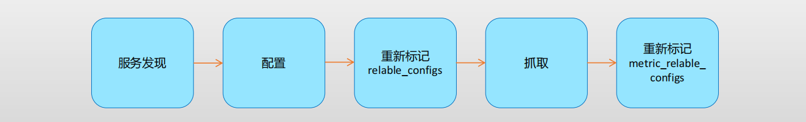

# Prometheus自动发现服务

## 1.Prometheus服务发现机制

- Prometheus Server的数据抓取工作于Pull模型，因而，它必需要事先知道各Target的位置，然后才能从相应的Exporter或Instrumentation中抓取数据；
  1. 对于小型的系统环境来说，通过static_configs指定各Target便能解决问题，这也是最简单的配置方法；
     - 每个Targets用一个网络端点（ip:port）进行标识；
  2. 对于中大型的系统环境或具有较强动态性的云计算环境来说，静态配置显然难以适用；
  3. 因此，Prometheus为此专门设计了一组服务发现机制，以便于能够基于服务注册中心（服务总线）自动发现、检测、分类可被监控的各Target，以及更新发生了变动的Target；

## 2.指标抓取的生命周期

- 在每个scrape_interval期间，Prometheus都会检查执行的作业（Job）；
- 这些作业首先会根据Job上指定的发现配置生成target列表，此即服务发现过程；
  1. 服务发现会返回一个Target列表，其中包含一组称为元数据的标签，这些标签都以\_\_meta\_\_为前缀；
  2. 服务发现还会根据目标配置来设置其它标签，这些标签带有\__前缀和后缀，包括\_\_scheme\_\_、\_\_address\_\_和\_\_metrics_path\_\_，分别保存有target支持使用协议(http或https，默认为http）、target的地址及指标的URI路径（默认为/metrics）；
  3. 若URI路径中存在任何参数，则它们的前缀会设置为\_\__param_
  4. 这些目标列表和标签会返回给Prometheus，其中的一些标签也可以配置中被覆盖；
- 配置标签会在抓取的生命周期中被重复利用以生成其他标签，例如，指标上的instance标签的默认值就来自于\__address__标签的值；

- 对于发现的各目标，Prometheus提供了可以重新标记(relabel) 目标的机会
  1. 它定义在job配置段的relabel_config配置中，常用于实现如下功能
     - 将来自服务发现的元数据标签中的信息附加到指标的标签上；
     - 过滤目标；
- 抓取而来的指标在保存之前，还允许用户对指标重新打标并过滤的方式；
  1. 它定义在job配置段的metric_relabel_configs配置中，常用于实现如下功能
     - 删除不必要的指标；
     - 从指标中删除敏感或不需要的标签；
     - 添加、编辑或修改指标的标签值或标签格式；

## 3.Prometheus可集成的服务发现机制

- 不同场景中，服务注册中心的指代也会有所不同
  1. 公有或私有IaaS云自身保存有平台上的所有资源信息，其API Server便可作为Prometheus的服务发现媒介；
     - azure、ec2、digitalocean、gce、hetzner、
  2. Prometheus也可以集成到多种不同的开源服务发现工具上，以动态发现需要监控的目标；
     - Consul、Eureka Zookeeper Serverset或Airbnb Nerve等
  3. Prometheus也可以很好地集成到Kubernetes平台上，通过其API Server动态发现各类被监控的Pod（容器集）、Service、Endpoint、Ingress和Node对象；
     - 它也支持基于dockerswarm和marathon两款编排工具进行服务发现；
  4. Prometheus还支持基于DNS或文件的动态发现机制；

### 3.1.基于文件的服务发现

 

### 3.2.基于DNS的服务发现

### 3.3.基于Consul的服务发现

### 3.4.基于Kubernetes API的服务发现

#### 3.4.1.Node资源发现

#### 3.4.2.Pod资源发现

#### 3.4.3.Service资源发现

#### 3.4.4.Endpoint资源发现

#### 3.4.5.Ingress资源发现

