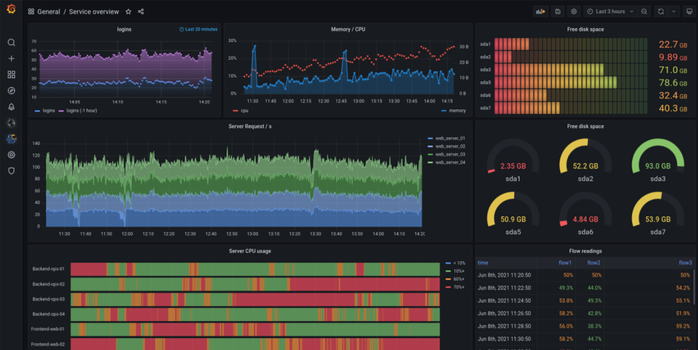

# 1. 监控系统组件

1. 指标数据采集
2. 指标数据存储
3. 指标数据趋势分析及可视化
4. 告警

# 2. 监控体系

1. 系统层监控

1. 1. 系统监控：CPU、Load、Memory、Swap、Disk IO、Processes、Kernel Parameters、……
   2. 网络监控：网络设备、工作负载、网络延迟、丢包率、……

1. 中间件及基础设施类系统监控

1. 1. 消息中间件：Kafka、RocketMQ和RabbitMQ等；
   2. Web服务容器：Tomcat和Jetty等；
   3. 数据库及缓存系统：MySQL、PostgreSQL、MogoDB、ElasticSearch和Redis等；
   4. 数据库连接池：ShardingSpere等；
   5. 存储系统：NFS和Ceph等

1. 应用层监控

1. 1. 用于衡量应用程序代码的状态和性能

1. 业务层监控

1. 1. 用于衡量应用程序的价值，例如电子商务网站上的销售量
   2. QPS、DAU日活、转化率；
   3. 业务接口：登录数、注册数、订单量、搜索量和支付量等