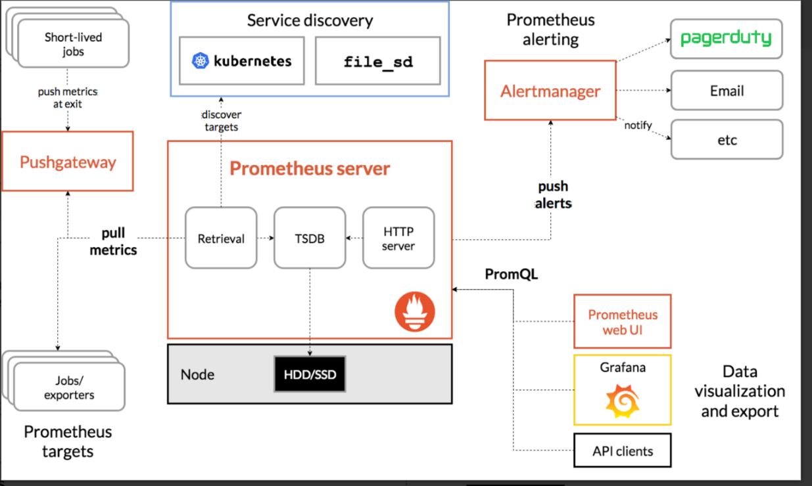
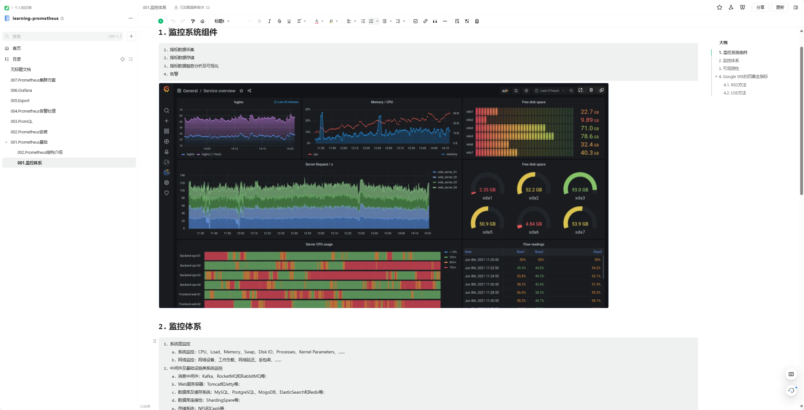
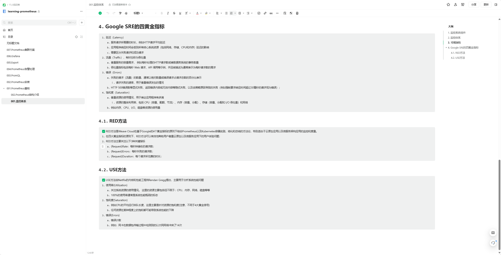

# 1. Prometheus 介绍

- https://prometheus.io/

1. Prometheus是基于go语⾔开发的⼀套开源的监控、报警和时间序列数据库的组合，是由SoundCloud公司开发的开源监控系统，Prometheus于2016年加⼊CNCF（Cloud Native Computing Foundation,云原⽣计算基⾦会）,2018年8⽉9⽇prometheus成为CNCF继kubernetes 之后毕业的第⼆个项⽬，prometheus在容器和微服务领域中得到了⼴泛的应用。

使⽤key-value的多维度(多个⻆度，多个层⾯，多个⽅⾯)格式保存数据 ，数据不使⽤MySQL这样的传统数据库，⽽是使⽤时序数据库，⽬前是使⽤的TSDB ⽀持第三⽅dashboard实现更绚丽的图形界⾯，如grafana(Grafana 2.5.0版本及以上) ，组件模块化 ，不需要依赖存储，数据可以本地保存也可以远程保存，平均每个采样点仅占3.5 bytes，且⼀个Prometheus server可以处理数百万级别的的metrics指标数 据。 ⽀持服务⾃动化发现(基于consul等⽅式动态发现被监控的⽬标服务) 强⼤的数据查询语句(PromQL,Prometheus Query Language) ，数据可以直接进⾏算术运算 ，易于横向伸缩 ，众多官⽅和第三⽅的exporter实现不同的指标数据收集。

1. 容器监控的实现⽅对⽐虚拟机或者物理机来说⽐⼤的区别，⽐如容器在k8s环境中可以任意横向扩容与缩容，那么就需要监控服务能够⾃动对新创建的容器进⾏监控，当容器删除后⼜能够及时的从监控服务中删除，⽽传统的zabbix的监控⽅式需要在每⼀个容器中安装启动agent，并且在容器⾃动发现注册及模板关联⽅⾯并没有⽐较好的实现⽅式。
2. Prometheus支持通过三种类型的途径从目标上抓取（Scrape）指标数据；

1. 1. Exporters 
   2. Instrumentation 
   3. Pushgateway

